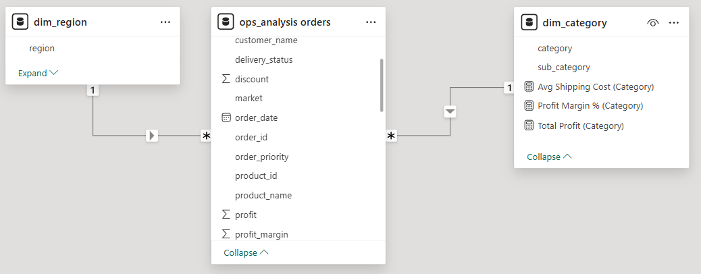
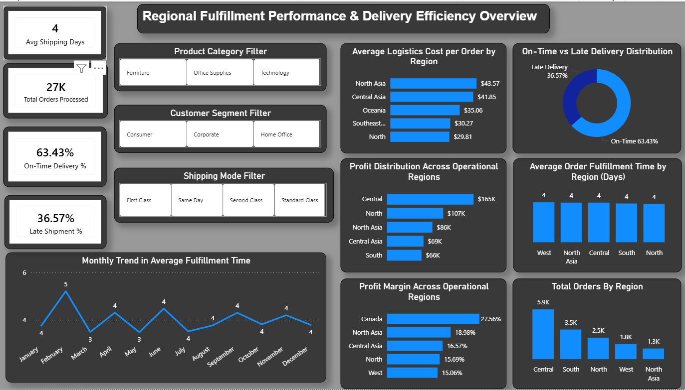
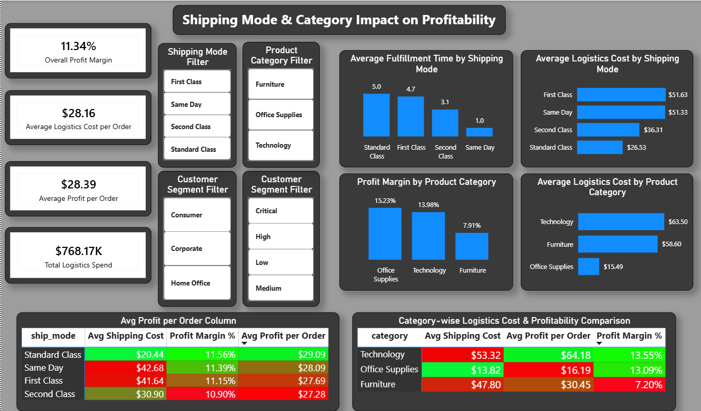

# Logistics-Operations-Efficiency-and-Profitability-Analysis

Operational analytics project evaluating fulfillment efficiency and profitability impact of logistics decisions across shipping modes, operational regions, and product categories using PostgreSQL and Power BI.

---

##  Business Objective

This project aims to analyze the operational performance of order fulfillment processes and assess the financial impact of logistics decisions on transactional profitability.

The analysis was designed to address the following business challenges:

### Fulfillment Challenges:

* Delayed deliveries across specific operational regions
* Variation in order fulfillment time across shipping modes
* Inefficient allocation of logistics resources across product categories

### Financial Challenges:

* Rising logistics cost per fulfilled order
* Profit margin variation across product categories
* Potential overuse of cost-intensive shipping modes

---

## Dataset Overview

The analysis utilizes the Global Superstore transactional dataset capturing order-level business events across operational regions.

Each record represents a single order line transaction containing:

* Order Date
* Shipment Date
* Shipping Mode
* Product Category
* Customer Segment
* Operational Region
* Sales Revenue
* Profit Earned
* Shipping Cost
* Order Priority

This dataset supports analysis of fulfillment performance, delivery delay patterns, logistics cost distribution, and category-level profitability.

---

## Data Cleaning & Transformation (PostgreSQL)

Data preprocessing was performed in PostgreSQL to standardize transactional records and engineer operational KPIs.

Key transformations included:

* Handling mixed-format date fields
* Converting textual dates into DATE format
* Creating Shipping Days metric
* Classifying Delivery Status (On-Time / Late Delivery)
* Calculating Profit Margin
* Removing fulfillment outliers exceeding acceptable delivery duration

These transformations enabled accurate computation of delivery performance metrics.

---

## Data Modeling (Power BI)

A star schema-based dimensional model was implemented in Power BI to ensure analytical accuracy and performance optimization.

### Fact Table:

* Orders (Transactional Fulfillment Data)

### Dimension Tables:

* Region Dimension
* Product Category Dimension

One-to-many relationships were established between dimension tables and the primary fact table to support context-driven KPI aggregation.

---

---

## KPI Layer (DAX Measures)

Operational KPIs were created using DAX measures to evaluate fulfillment efficiency and financial performance.

Key performance indicators include:

* Average Fulfillment Time
* Late Delivery Rate (%)
* Profit Margin (%)
* Average Shipping Cost per Order
* Average Profit per Order
* Total Logistics Spend

---

## Dashboard 1: Regional Fulfillment Performance

This dashboard evaluates delivery performance across operational regions to identify fulfillment inefficiencies impacting logistics cost and profitability.

---

## Dashboard 2: Shipping Mode & Category Profitability

This dashboard analyzes the impact of shipping mode selection and product category characteristics on logistics cost and transactional profitability.

---

## Key Insights

* Analysis of regional fulfillment timelines indicates that the average order processing and dispatch duration remains largely consistent across operational   regions, suggesting that internal warehouse and order handling processes are standardized and functioning efficiently at a network-wide level.
This implies that variations in delivery performance across regions are unlikely to be driven by internal fulfillment delays and may instead be attributable to external logistics factors such as transportation lead time or last-mile delivery execution.

* Despite consistency in order processing timelines, regional variation in late shipment rates highlights discrepancies in delivery reliability across markets. This suggests that certain operational regions may be experiencing transit-level inefficiencies, potentially arising from suboptimal delivery routes or inconsistent logistics partner performance.
Such discrepancies may adversely impact service-level commitments and customer satisfaction in affected regions.

* Comparative analysis indicates that regions with relatively higher logistics cost per order tend to demonstrate lower overall profit contribution. This suggests that elevated fulfillment expenditure may be eroding transactional margins and negatively impacting financial performance in specific markets.
This trend highlights the need for closer alignment between logistics spend and revenue contribution across regional operations.

* Monthly trend analysis of average fulfillment time reveals variability in delivery performance across different periods. Such fluctuations may indicate inconsistencies in operational execution or demand-driven logistical strain during peak transaction volumes.
Maintaining stable fulfillment timelines is critical to ensuring consistent service quality and cost control.

* Evaluation of fulfillment performance across shipping modes indicates that premium delivery options such as Same Day and First Class incur substantially higher logistics cost per order compared to Standard Class shipping. However, this increased expenditure does not consistently translate into proportionate improvements in transactional profitability.
This suggests that the use of expedited shipping methods may be introducing incremental fulfillment costs without generating corresponding financial return, thereby impacting overall operational efficiency.

* Category-level analysis highlights that certain product segments, such as Furniture, exhibit comparatively lower profit margins while simultaneously incurring higher average logistics cost per order. This imbalance indicates that fulfillment strategies currently applied to these categories may be disproportionately impacting their transactional profitability.
Such categories may be more sensitive to logistics cost variations due to their inherent margin structure.

* In contrast, Technology products demonstrate relatively higher profit margins alongside moderate fulfillment cost, indicating a more favorable cost-to-margin ratio. This suggests that certain categories may be better positioned to accommodate expedited shipping without significantly compromising profitability.

* Shipping mode efficiency analysis reveals variability in both logistics cost and average profit per order across fulfillment strategies, suggesting that shipping mode selection plays a significant role in influencing transactional margin performance.
This underscores the importance of strategically managing logistics decisions based on cost-benefit considerations.
---

## Recommendations

* Given that internal order processing timelines appear consistent across regions, operational improvement initiatives should focus on optimizing external transit and last-mile delivery performance. This may include revisiting delivery route planning, strengthening coordination with logistics providers, or evaluating alternative transportation strategies to reduce shipment delays.

* Regions demonstrating higher late shipment rates should undergo targeted performance audits of logistics partners to identify delivery inefficiencies and ensure adherence to service-level agreements. Enhancing carrier performance through renegotiated delivery timelines or revised route allocation may improve delivery reliability.
  
* To address elevated logistics cost in certain regions, the organization may consider implementing region-specific fulfillment strategies such as increasing utilization of cost-efficient shipping modes or improving inventory placement across decentralized warehousing facilities to minimize shipping distance and associated cost.
  
* Institutionalizing periodic monitoring of regional delivery performance metrics such as fulfillment time and late shipment rate can enable early detection of emerging operational bottlenecks and facilitate proactive intervention to maintain service consistency.

* It is recommended to selectively utilize premium shipping modes for high-margin product categories where the additional logistics cost can be effectively absorbed without materially affecting profit margins. Restricting expedited fulfillment to financially viable transactions may help reduce unnecessary operational expenditure.

* For product categories demonstrating lower margin performance, it may be beneficial to prioritize cost-efficient shipping modes and reassess fulfillment strategies to mitigate excessive logistics expenditure and preserve unit-level profitability.

* Consider aligning shipping mode selection with category-level profitability by enabling expedited fulfillment options for categories exhibiting higher margins and stronger financial resilience to logistics cost.

* Establish periodic performance monitoring of shipping modes in relation to logistics cost and profit contribution to facilitate data-driven fulfillment strategy decisions and support optimal allocation of logistics resources.

---

## Tools & Technologies Used

* PostgreSQL
* Power BI
* DAX
* Power Query
* Canva

---

---

##  Acknowledgements

Dataset Source: Global Superstore Dataset

---
